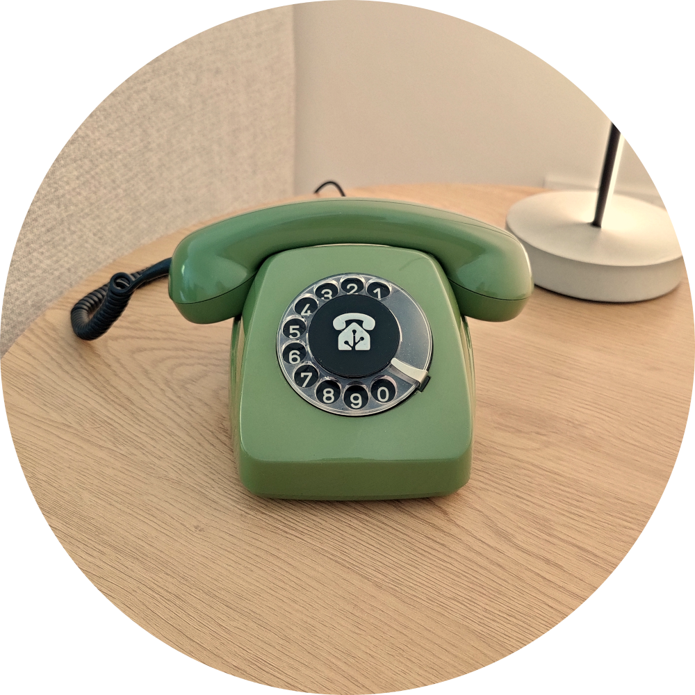
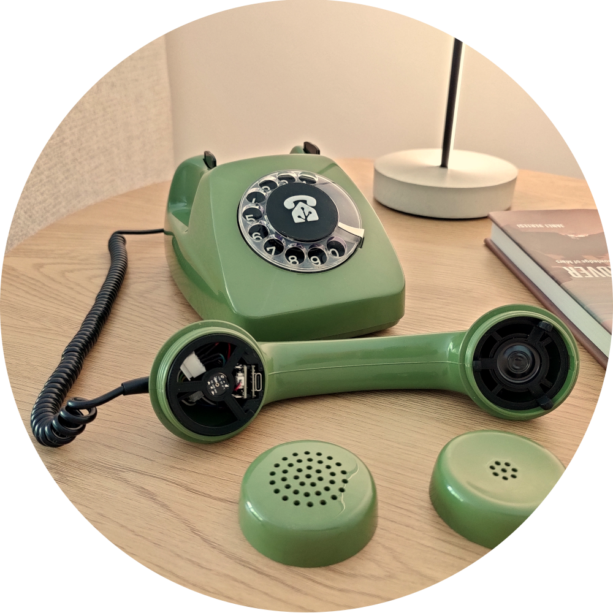
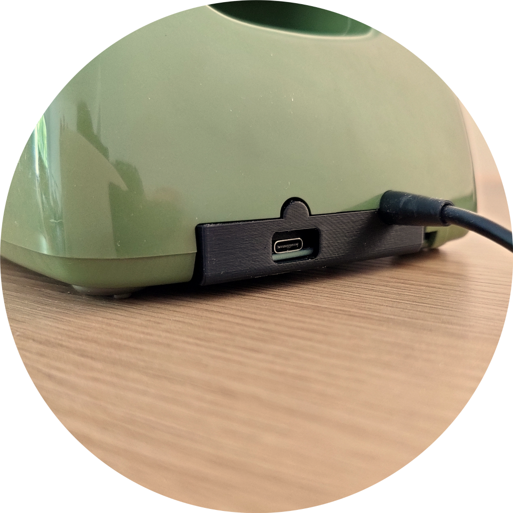

# FeTAp-32

<picture>
  <source srcset="doc/images/fetap32-logo-text-black.svg" media="(prefers-color-scheme: light)"/>
  <source srcset="doc/images/fetap32-logo-text-white.svg"  media="(prefers-color-scheme: dark)"/>
  
</picture>

## Description
FeTAp-32 is an open-source project that turns an old FeTAp 611-2 (Fernsprechtischapparat) into a voice assistant device through an ESP32-C3 and [esphome](https://esphome.io/).

## Features
- Fully functional rotary dial with customizable automations for each digit
- Power delivery through USB-C, network connectivity through Wifi 2.4 GHz
- Enhanced privacy as microphone is only active if handset is lifted-up
- No wake-word detection required, the assistant is started when the handset is picked up
- Modular and customizable through esphome

  
   
  

## Building instructions (Hardware and Software)
The manual can be found [here](doc/manual/manual.pdf)

## Disclaimer and warning
Recreating this project involves handling dangerous things like soldering irons and 3D-printers. For legal reasons, handling these things should only be done by an expert. I am not responsible for any damage to you, your telephone or your surrounding. Read through the complete manual to decide if you feel comfortable building the project.

## Required Tools
- 3D-printer
- soldering iron
- connector crimping kit (see BoM, optional but recommended)

## Bill of Materials (BoM)
The following items are necessary to build the FeTAp-32. Items marked with a (*) at the beginning do not need to be the exact listed item but may be replaced with something else. Sourcing links are included for people based in germany (those are the shops where I got the items from).

|Item|Amount|Description|Comment|Sourcing (DE)|
|---|---|---|---|---|
|FeTAp 611-2|1|the telephone|Commonly found on kleinanzeigen for cheap. Doesn't have to be functional as the ESP will replace the PCB.|-|
|Seeed Xiao ESP32C3|1|Modem and microcontroller|-|[Botland](https://botland.de/wifi-und-bt-module-esp32/21859-seeed-xiao-esp32-c3-wlan-bluetooth-seeedstudio-113991054.html) [Reichelt](https://www.reichelt.de/de/de/shop/produkt/xiao_esp32c3_wifi_bt-358356?search=esp32c3&)|
|Adafruit USB Type-C Breakout Board (ADA4090)|1|port for power over USB-C|-|[Berrybase](https://www.berrybase.de/adafruit-usb-type-c-breakout-board-downstream-verbindung)|
|Stranded Wire|~2m|wire to connect the components with each other|I recommend stranded wires and getting multiple colors to make it easier. The wires I used were multi-stranded with 0.14mm^2 diameter (approx. 25 AWG)|[Reichelt](https://www.reichelt.de/de/de/shop/produkt/kupferlitze_isoliert_10_m_1_x_0_14_mm_blau-10292)|
|INMP441 MEMS Microphone|1|digital microphone to capture voice commands|Optional, if you don't want voice assistant capabilities (e.g. only want to use the rotary dial)|[Berrybase](https://www.berrybase.de/inmp441-mems-omnidirektionales-mikrofonmodul-i2s-interface)|
|*Adafruit I2S Amplifier (ADA5769)|1|amplifier for the handset speaker|Optional, if you don't need audio output. There is also a version without SD-Card slot (ADA5770) that should also work.|[Botland](https://botland.de/mp3-wav-ogg-midi-player/23827-audio-bff-add-on-3w-i2s-audio-verstarker-modul-fur-qt-py-und-xiao-adafruit-5769.html) [Berrybase](https://www.berrybase.de/adafruit-audio-add-on-fuer-qt-py-und-xiao)|
|YD27 0.5W 8 Ohm speaker|1|speaker for audio feedback from voice assistant|Optional, if you don't need audio output.|[Botland](https://botland.de/analoge-lautsprecher/3471-lautsprecher-yd27-05w-8ohm-27x5mm-5903351245876.html)|
|Adafruit Molex PicoBlade cable|1|connector and cable for speaker and I2S amplifier|Optional, if you don't need audio output.|[Berrybase](https://www.berrybase.de/adafruit-molex-picoblade-kabel-2-polig-200mm-1.25mm-pitch-reibungsverriegelung)|
|*JST-XH 5-Pin Male and Female connectors|1|connector for microphone and esp|Optional, if you don't want to use a microphone or directly solder the wires together|[Amazon](https://www.amazon.de/SOMELINE%C2%AE-Crimpzange-Stecker-JST-XH-EI-Serie/dp/B0C8N8JBDC/ref=sr_1_3?__mk_de_DE=%C3%85M%C3%85%C5%BD%C3%95%C3%91&crid=3J1K71LNK2FDV&dib=eyJ2IjoiMSJ9.pArUK_eGty1pAgamqIY4_BHLJO1GMTUpvBCKUM6AajcX0ukeQaeLbxZTvJBAs86amfG5XtzwkAoNbBgEeIc5P0AreLSgwFRoLUT5_rjJkrtYyds6TmB06oM81KUYJ0z-ANbTlGseP2Wnnz54JKPoMP5xAROhVmjchvUUhs9nUkRk5gD6pNmIGrcszs6fYatRbKhPy3f6j97A1tpQAMwPtl34kOTrETaFiA0MgZWvaIdlv-E2zAWOIiZD48I_HoaKaaoXz4pE82fpEx_Ywy7sNCCHhJLpBkRttwkq1zJLzNs.26g--6kJexrT3M9r00q73i490hw2o_FcewUZZjJ7lT4&dib_tag=se&keywords=someline%2Bdupont&qid=1719741155&sprefix=someline%2Bdupont%2Caps%2C71&sr=8-3&th=1)|
|*JST-XH 4-Pin Male and Female connectors|2|connectors for handset, housing and esp|Optional, if you want to directly solder the wires together|see above|
|*JST-XH 2-Pin Male and Female connectors|3|connectors for power, rotary-dial-sensor and handset-sensor|Optional, if you don't want to use a microphone or directly solder the wires together|see above|

Apart from the items listed above, you will need common consumables like shrink tubing, solder and 3D-printer filament.